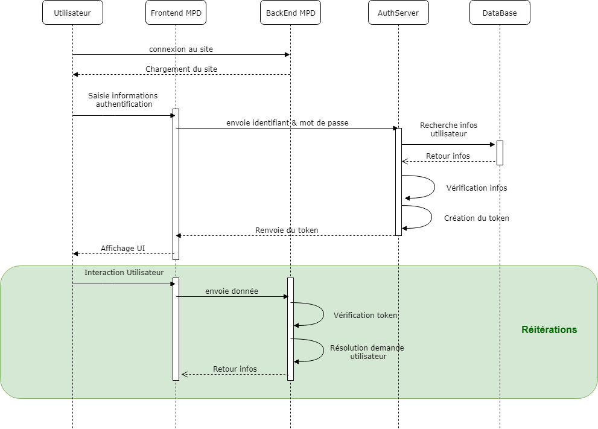

# AuthManager

AuthManager est un server d'authentification Java basique créé avec Spring Security. Il est autonome et permet de gérer, grâce à un base de données (Mysql), un ensemble d'utilisateurs et de leurs attribuer des rôles et/ou des permissions liées aux ressources pour une application backend CRUD créée avec SpringBoot. Le serveur permettra de mettre en place un système d'autorisation par token (JWT). Coté front, il sera possible d'extraire du token les informations qu'il contient (utilisateur, rôle...). 

La suite de ce document détaille comment integrer à une application CRUD réalisée avec SpringBoot une couche de sécurité "basique".

Le server d'authentification peut fonctionner selon deux modes de travail :
 * Gestion de rôles simplifiée pour une application
 * Gestion de rôles avec permission sur des ressources

## Installation et configuration

Après chargement de l'ensemble des fichiers du projet, procéder dans l'ordre suivant :
 * Créer une base de donnée nommée **auth_manager** dans Mysql
 * Dans le fichier application.properties modifier la phrase secrète permettant l'encodate du token **jwt.secret** et éventuellement la durée de validité du token **jwt.timetolive**.
 * Compiler le server grâce à Maven : ```mvnw clean install```

Une fois toutes ces étapes réalisées, il ne vous reste plus qu'à lancer la server d'authentification grâce à la commande : 
```mvnw spring-boot:run```

# Gestion de rôles simplifiée
 
Il s'agit du mode de fonctionnement le plus simple. Dans ce mode, on définit des rôles qu'il sera possible d'affecter aux utilisateurs qui seront créés pour votre application.
 
A chaque nouvelle demande de connexion, la partie front de l'application cliente appellera l'api '/auth' du serveur d'authentification en lui fournissant l'identifiant et mot de passe de l'utilisation. En retour, si l'utilisateur existe dans la base de données et que le mot de passe associé est valide, il recevra un token d'authentification valide pour une certaine durée.

Pour la suite, il faudra ajouter ce token dans le champ "Authorization" des requêtes http qui seront faite par le client front.



## Configuration du server d'authentification

Le serveur d'application met à disposition une API CRUD qu'il est possible d'intégrer à une application cliente. Pour sa mise en place, dans un premier temps, nous conseillons aux administrateurs d'utiliser l'outil PostMan pour la mise en place initiale

### Gestion des rôles

#### Récupération de la liste des rôles disponibles

Pour récupérer la liste des rôles existants, faire une request GET à l'adresse http://localhost:4242/api/role.

#### Récupération des informations d'un rôle

Pour les informations relatives à un rôle existant, faire une request GET à l'adresse http://localhost:4242/api/role/idRole en modifiant idRole par l'id du rôle dans la base de données.

#### Création d'un rôle
Pour créer un nouveau rôle, faire une request POST à l'adresse http://localhost:4242/api/role en transmettant dans le body au format JSON (application/json) des données au format suivant :

```données de requête
{
	"name":"NomDuRole"
}
```
En modifiant NomDuRole par la nom du rôle à créer. Le retour de la requête contiendra l'objet rôle créé et notamment l'id associé qu'il nous faudra réutiliser pour l'attribution des rôles aux utilisateurs.

#### Modification d'un rôle
Pour modifier un rôle existant, faire une request PUT à l'adresse http://localhost:4242/api/role/idRole en modifiant idRole par l'id du rôle dans la base de données.

#### Suppression d'un rôle

Pour supprimer un rôle existant, faire une request DELETE à l'adresse http://localhost:4242/api/role en transmettant dans le body au format JSON (application/json) des données au format suivant :

```données de requête
{
	"id":idDuRole,
}
```
En modifiant idDuRole.

### Gestion des utilisateurs

#### Récupération de la liste des utilisateurs disponibles

Pour récupérer la liste des utilisateurs existants, faire une request GET à l'adresse http://localhost:4242/api/user.

#### Récupération des informations d'un utilisateur

Pour les informations relatives à un utilisateur existant, faire une request GET à l'adresse http://localhost:4242/api/user/idUtilisateur en modifiant idUtilisateur par l'id de l'utilisateur dans la base de données.

#### Création d'un utilisateur
Pour créer un nouvel utilisateur, faire une request POST à l'adresse http://localhost:4242/api/user en transmettant dans le body au format JSON (application/json) des données au format suivant :

```données de requête
{
  "username":"nomUtilisateur",
  "email":"emailUtilisateur",
  "role":{
  		"id":idRole
  }
}
```
En modifiant nomUtilisateur, emailUtilisateur et idRole. Le retour de la requête contiendra l'objet utilisateur et notamment son id.

**Remarque :** Le compte utilisateur est créé à l'état "ACTIVE" avec pour password "password".

#### Modification d'un utilisateur
Pour modifier un rôle existant, faire une request PUT à l'adresse http://localhost:4242/api/role/idUtilisateur en transmettant dans le body au format JSON (application/json) des données au format suivant :

```données de requête
{
  "username":"nomUtilisateur",
  "email":"emailUtilisateur",
  "role":{
  		"id":idRole
  }
}
```

En modifiant nomUtilisateur, emailUtilisateur et idRole.


**Remarque :** il est également possible de ne modifier qu'une partie des paramètres (les autres conservent alors leur valeur précédente).

#### Suppression d'un utilisateur

Pour supprimer un utilisateur existant, faire une request DELETE à l'adresse http://localhost:4242/api/user/idUtilisateur en modifiant idUtilisateur par l'id de l'utilisateur dans la base de données.

## Sécurisation du backend SpringBoot

Côté backend, il est nécessaire d'ajouter les dépendances suivantes au fichier pom.xml de votre projet :

```java
		<dependency>
			<groupId>org.springframework.boot</groupId>
			<artifactId>spring-boot-starter-security</artifactId>
		</dependency>
		<dependency>
		    <groupId>io.jsonwebtoken</groupId>
		    <artifactId>jjwt</artifactId>
		    <version>0.9.0</version>
		</dependency>
```

Nous vous conseillons de créer un package security dans lequel il faudra créer 3 classes dont le code vous est fourni ci-dessous :
 * JWTAuthenticationFilter.java : classe mère factorisant des méthodes de filtrage.
 * JWTRoleAuthenticationFilter.java : implémentation d'un filtre se basant sur les rôles.
 * WebSecurityConfig.java : classe de configuration pour Spring Security.

**JWTAuthenticationFilter.java**

Copier le code ci-dessous dans la classe JWTAuthenticationFilter.java.

```java
import javax.servlet.ServletRequest;
import javax.servlet.http.HttpServletRequest;

import org.springframework.web.filter.GenericFilterBean;

import io.jsonwebtoken.Claims;
import io.jsonwebtoken.Jwts;

public abstract class JWTAuthenticationFilter extends GenericFilterBean {

	private String JWT_SECRET="This is my super secret string";
	private String JWT_HEADER="Authorization";
	private String JWT_PREFIX="Bearer";
	
	protected Claims extractTokenClaims(ServletRequest request) {
		HttpServletRequest httpServletRequest = (HttpServletRequest) request;

		Claims claims = null;
		try {
			String token = httpServletRequest.getHeader(JWT_HEADER);
			claims = Jwts.parser()
		            .setSigningKey(JWT_SECRET)
		            .parseClaimsJws(token.replace(JWT_PREFIX, ""))
		            .getBody();
		}
		catch (Exception e) 
		{}
		
		return claims;
	}
	
	protected boolean checkTokenValidity(Claims claims){
		
        // Check the token expiration
        long expiration = claims.getExpiration().getTime();
        long notBefore = claims.getNotBefore().getTime();
        long now = System.currentTimeMillis();
		if((now > notBefore) && (expiration > now))
			return true;
		
		return false;
	}
}
```

**Remarque importante :** Il faut modifier dans cette classe la phrase secrète et inclure la même que dans le fichier properties du server d'authentification.

**JWTRoleAuthenticationFilter.java**

Copier le code ci-dessous dans la classe JWTRoleAuthenticationFilter.java.

``` java
import java.io.IOException;
import java.util.ArrayList;
import java.util.List;

import javax.servlet.FilterChain;
import javax.servlet.ServletException;
import javax.servlet.ServletRequest;
import javax.servlet.ServletResponse;

import io.jsonwebtoken.Claims;

public class JWTRoleAuthenticationFilter extends JWTAuthenticationFilter {
	
	private List<String> acceptedRoles = new ArrayList<String>();
	
	public JWTRoleAuthenticationFilter(String... roles) {
		// Build the list of accepted roles
		for(int i=0; i<roles.length ; i++){
			acceptedRoles.add(roles[i]);
		}
	}
	
	@Override
	public void doFilter(ServletRequest request, ServletResponse response, FilterChain chain)
			throws IOException, ServletException {
		
		// Extract all the token claims
		Claims claims = extractTokenClaims(request);
		
		// Check the validity of the token
		if((claims != null) && checkTokenValidity(claims)) {
			Object roleObj = claims.get("role");
			if(roleObj instanceof String)
			{
				String role = (String) roleObj;
				
				// If the role is in the list of the accepted roles => validate the filter
				if(acceptedRoles.contains(role))
					chain.doFilter(request, response);
			}
		}
	}
}
```

**WebSecurityConfig.java**

Copier le code ci-dessous dans la classe JWTRoleAuthenticationFilter.java.

``` java
import org.springframework.security.config.annotation.web.builders.HttpSecurity;
import org.springframework.security.config.annotation.web.configuration.EnableWebSecurity;
import org.springframework.security.config.annotation.web.configuration.WebSecurityConfigurerAdapter;
import org.springframework.security.web.authentication.UsernamePasswordAuthenticationFilter;

import co.simplon.springboot.simplecrud.security.JWTRoleAuthenticationFilter;

@EnableWebSecurity
public class WebSecurityConfig extends WebSecurityConfigurerAdapter {
	  @Override
	  protected void configure(HttpSecurity http) throws Exception {
		  http.csrf().disable().authorizeRequests()
			INSERT CODE HERE;
	  }
}
```

Il s'agit de la structure de base qui contient la méthode en charge de sécuriser l'accès aux API. Pour sécuriser votre application insérer le bloc ci-dessous contextualisé pour vos API autant de fois qu'il y a d'API à sécuriser à la place de "INSERT CODE HERE" :

``` java
		  	.antMatchers("chemin_api").permitAll()
		  		.and()
		  		.addFilterBefore(new JWTRoleAuthenticationFilter("role1", "role2", ...),  UsernamePasswordAuthenticationFilter.class);
```
Par exemple pour sécuriser les API "/api1" et "/api2" respectivement avec les rôles "role1" et "role2", on a le code suivant :

``` java
import org.springframework.security.config.annotation.web.builders.HttpSecurity;
import org.springframework.security.config.annotation.web.configuration.EnableWebSecurity;
import org.springframework.security.config.annotation.web.configuration.WebSecurityConfigurerAdapter;
import org.springframework.security.web.authentication.UsernamePasswordAuthenticationFilter;

import co.simplon.springboot.simplecrud.security.JWTRoleAuthenticationFilter;

@EnableWebSecurity
public class WebSecurityConfig extends WebSecurityConfigurerAdapter {
	  @Override
	  protected void configure(HttpSecurity http) throws Exception {
		  http.csrf().disable().authorizeRequests()
		  	.authorizeRequests().antMatchers("/api1").permitAll()
		  		.and()
		  		.addFilterBefore(new JWTRoleAuthenticationFilter("role1"),  UsernamePasswordAuthenticationFilter.class);
		  	.authorizeRequests().antMatchers("/api2").permitAll()
		  		.and()
		  		.addFilterBefore(new JWTRoleAuthenticationFilter("role2"),  UsernamePasswordAuthenticationFilter.class);
	}
}
```

## Utilisation côté Front / Angular

Coté Angular, le point de départ pour la sécurisation sera le formulaire de saisie de l'identifiant et du mot de passe de l'utilisateur. Quand l'utilisateur validera sa saisie, votre client angular devra appeler le server d'authentification à l'adresse http://localhost:4242/api/auth en transmettant dans le body au format JSON (application/json) des données au format suivant :

```données de requête
{
	"username":"NomUtilisateur",
	"password":"MotDePasseUtilisateur"
}
```

En remplaçant NomUtilisateur et MotDePasseUtilisateur par des données de comptes valide dans la base de données. Il se verra alors retourner un token JWT qu'il faudra ensuite ajouter ensuite dans le champ "Authorization" de l'entête des requêtes qui seront faites par la suite à votre back SpringBoot précédemment configuré.

Il sera également possible d'extraire du token les informations ci-dessous pour construire une ihm adapté à l'utilisateur connecté :
 * nom de l'utilisateur
 * email de l'utilisateur
 * role de l'utilisateur
 
## Modifications à apporter côté Angular

# Gestion de rôles avec permission

A venir si besoin.
